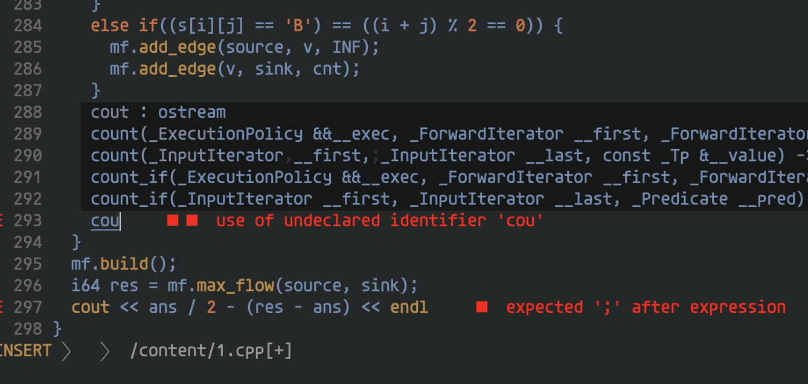

# neovim(HEAD) on docker 

## /nvim\_builder

Build [neovim](https://github.com/neovim/neovim) from source(HEAD).
You can try built neovim on this image.

MEMO: image size 148MB with debian:bullseye

## /ccls\_example

Example for neovim on gcc11.2.0 docker image with
- [ccls](https://github.com/MaskRay/ccls)(C++ language server)
- [nvim-lspconfig](https://github.com/neovim/nvim-lspconfig)
- [vim-cpp-enhanced-highlight](https://github.com/octol/vim-cpp-enhanced-highlight)
- [lyla.vim](https://github.com/niuez/lyla.vim)(my colorscheme)
- my neovim config files(in `ccls_example/nvim`)

```sh
docker build -t nvim_ccls ccls_example

# if you edit a single .cpp file, you should create .ccls(ccls config file)
touch .ccls

docker run -it --rm -v "$PWD":/content nvim_ccls 1.cpp
```



## TODO

- [ ] push nvim\_builder to docker Hub to use `FROM nvim_builder as builder`
